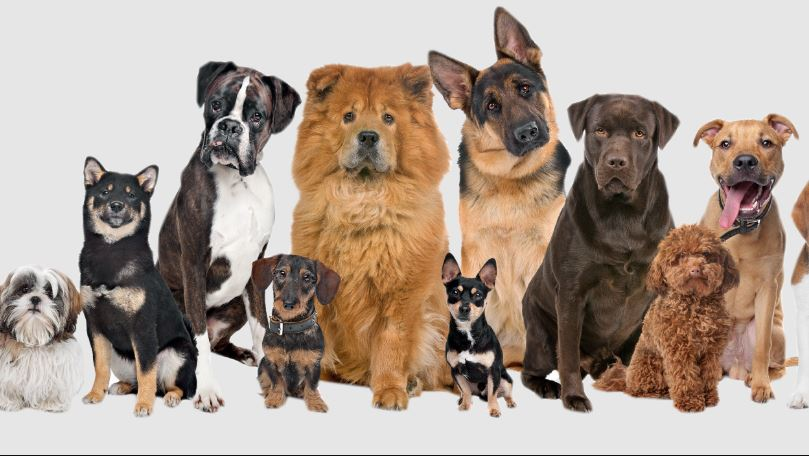
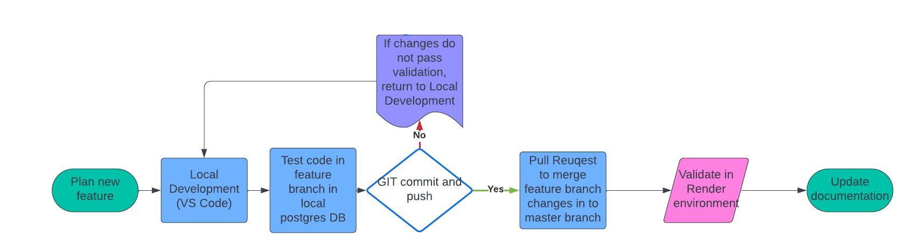

:WEBAPI_APP: My web app
:WEBAPI_LOC: Bethel
:WEBAPI_ENV: Production
:WEBAPI_URL: https://web-5lr9.onrender.com
:WEBAPI_STS: Available
:WEBAPI_VER: 1.1.0

[orientation=landscape]
# Web App Documentation

## What operating system was used
This application was designed in Visual Studios on a Windows 10 laptop. It can be viewed in any browser.

## What programming languages were used
HTML, CSS, Jquery, JavaScript

## Application Environment Details
[grid="rows",format="csv"]
[options="header",cols="^,<,<s,<,>m"]
|=====================================
App,Location,Environment,URL,Version
`{WEBAPI_APP}`, `{WEBAPI_LOC}`, `{WEBAPI_ENV}`, `{WEBAPI_URL}`, `{WEBAPI_STS}`, `{WEBAPI_VER}`, 
|=====================================

## Git Flowchart
[orientation=landscape]
